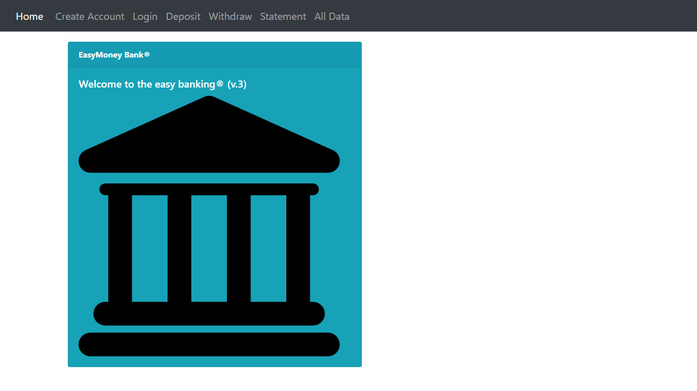
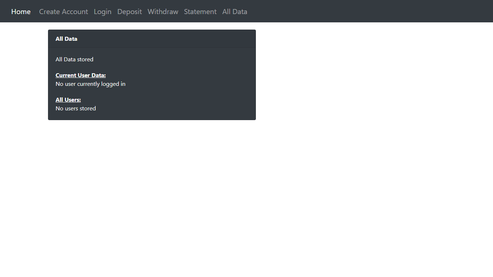
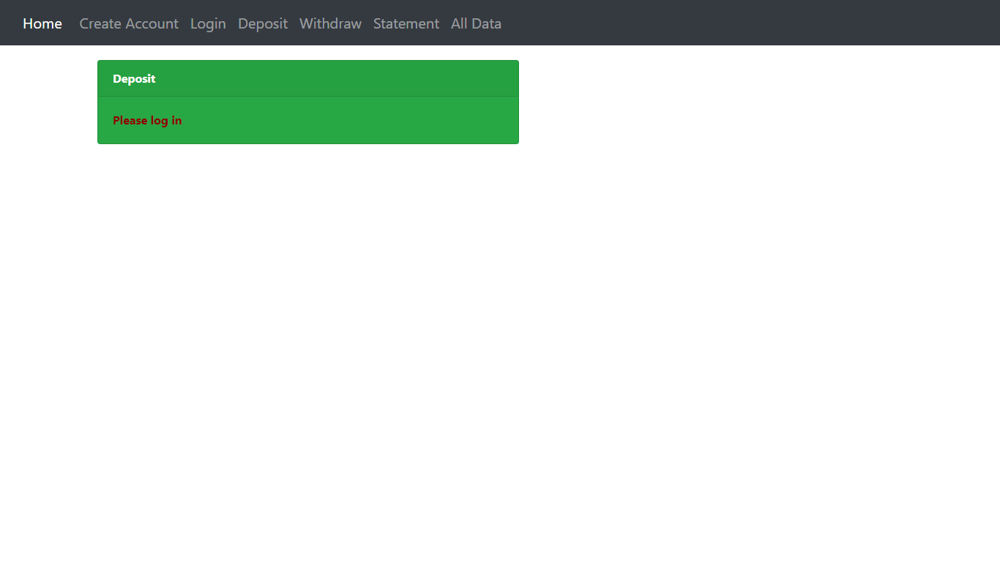

# Puppeteer 
>A project based on an original exercise/assignment from MIT Back-end module MIT xPRO Professional Certificate in Coding: Full Stack Development with MERN June 2021

## Usage from the original exercise/assignment:
How to call puppeteer-add.js and puppeteer-delete.js:
A local MongoDB must be on
Server must be up
Client (the target page) must be up
Examples:
	`node` puppeteer-add.js
	`node` puppeteer-delete.js
	`node` puppeteer-cmd.js action=click targettype=class TARGET=create-user
	`node` puppeteer-cmd.js action=click targettype=class TARGET=delete-user

## Original Assignment Instructions:	
Use Puppeteer to test the front end

Now that you’ve learned about Puppeteer and how it can help with automated UI testing, you will integrate Puppeteer into a basic MERN application. Download the starter files. (Links to an external site.)

In order to complete this activity, you must have MongoDB installed and running on your machine. You can find the installation instructions for Windows, Mac, and Linux here (Links to an external site.).

This application is a slightly modified version of the one you previously worked on when working with Docker. 

The app is split into two folders:
Client, which contains the React portion of the application
Server, which contains the back end portion

src/App.js contains the entire screen content along with the buttons.
src/App.css contains the styles for the application.
server.js contains the code for starting the express server and defining the two express routes for creating and deleting users.
src/database.js contains the code for initializing the MongoDB database.
src/puppeteer.js contains the starter code and is where all of your code edits will take place.

Write your code in the file “server/src/puppeteer.js.” The “testCreateUserButton” function in “puppeteer.js” is called at the end of “server.js.”
Instructions:

Install the npm dependencies in both the front end and back end with “npm install” from the root of each folder (server and client). Then, from the server directory, start server using “npm run start.” Finally, from the client directory, start the application server using “npm run start.” Then, navigate to http://localhost:3000 (Links to an external site.).
Your goal for this activity is to set up Puppeteer so that, when triggered, it will click the “Create User” button and then take a screenshot of the browser with the newly created user.
Note that this application has two buttons. One will create a new user with fake information made with the Faker (Links to an external site.) package. The other will delete all of the users from the list. 

Follow the hints in the code comments to test the “Create User” button. When finished, submit a screenshot created by Puppeteer.
If you need help, don’t forget to look at the Puppeteer documentation (Links to an external site.) and examples (Links to an external site.).

# NOTES on coding experience:
## Try...Catch...Finally
I added the try...catch...finally structure to test it
it seems to works fine
but initially I was getting warnings of "deprecation":
(node:116156) UnhandledPromiseRejectionWarning: ReferenceError: browser is not defined
(node:116156) UnhandledPromiseRejectionWarning: Unhandled promise rejection. This error originated either by throwing 
inside of an async function without a catch block, or by rejecting a promise which was not handled with .catch(). To terminate the node process on unhandled promise rejection, use the CLI flag `--unhandled-rejections=strict` (see https://nodejs.org/api/cli.html#cli_unhandled_rejections_mode). (rejection id: 1)
(node:116156) [DEP0018] DeprecationWarning: Unhandled promise rejections are deprecated. In the future, promise rejections that are not handled will terminate the Node.js process with a non-zero exit code.
I SOLVED the warnings by redefining scope of the "browser" variable by creating it outside the try..finally block

## Catch arguments from the command line
My second improvement was to catch arguments from the command line 
so that we could use it as parameter to determine the button or class to be "clicked"
https://stackoverflow.com/questions/4351521/how-do-i-pass-command-line-arguments-to-a-node-js-program
var args = process.argv.slice(2);

or:
print process.argv
process.argv.forEach(function (val, index, array) {
    console.log(index + ': ' + val);
  });
  This will generate:
 
  $ node process-2.js one two=three four
  0: node
  1: /Users/mjr/work/node/process-2.js
  2: one
  3: two=three
  4: four

## Rewrote the wrote async imediate call so that first we`ll evaluate the arguments provided in the command line
Async construction: https://developer.mozilla.org/en-US/docs/Web/JavaScript/Reference/Statements/async_function#description

## Other improvements:
- [x] created function findParam(argName) which searches for a desired argument extracted from the command line
- [x] findParam to take an "ignoreCase" option
- [x] findParam became a module exported at findParams.js
- [x] created `puppeteer-cmd.js` to use the args provided in the command line 
- [x] extended functionality with `puppeteer-cmd2.js` to enable simply opening any url and take a shot. We may use it with any URL that responds (locally or in the web)

### About the function findParam(argName)
This function returns:
- a string if param was found
- null if param was found by is empty
- undefined type if param was not found 

### Successful tests with my bank app running on the web: 
node puppeteer-cmd2.js url=http://www.easymoneybank.online/#

node puppeteer-cmd2.js url=http://www.easymoneybank.online/#/alldata

node puppeteer-cmd2.js url=http://www.easymoneybank.online/#/deposit

## Screenshot

